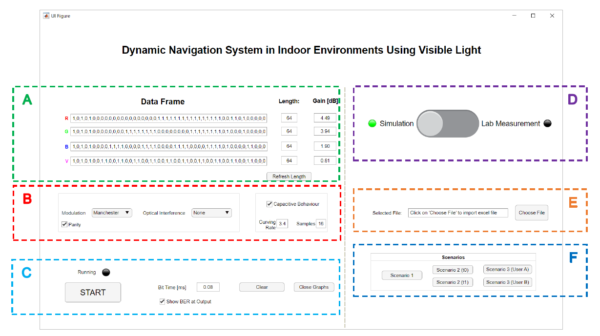
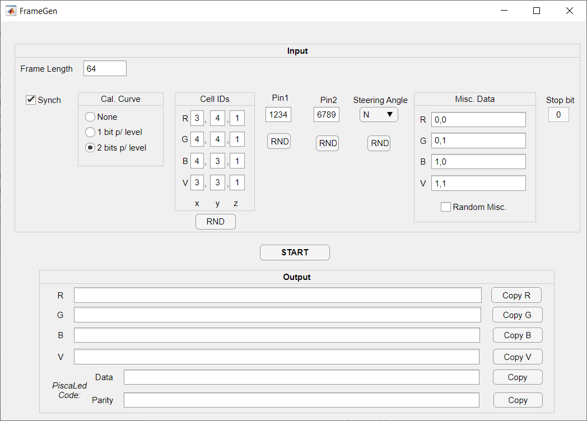

# SimulacaoVLC

(Work in Progress)

SimulacaoVLC is a set of MATLAB apps for planning, simulating and decoding VLC scenarios at [ISEL](https://www.isel.pt/)'s optoelectronics laboratory.

It currently consists of two apps:
- **SimVLC**
- **FrameGen**

## How to Open/Run
Both apps were developed using MATLAB version 2019b and require the following add-ons and toolboxes:
- [App Designer](https://www.mathworks.com/products/matlab/app-designer.html);
- [Communications Toolbox](https://www.mathworks.com/products/communications.html);
- [DSP System Toolbox](https://www.mathworks.com/products/dsp-system.html);
- [Mapping Toolbox](https://www.mathworks.com/products/mapping.html);

To open an app, first open MATLAB and type the following command in the command window:
>appdesigner

Doing so, will open MATLAB App Designer from which the `.mlapp` file can be opened and run.

Alternatively, the [MATLAB Compiler](https://www.mathworks.com/products/compiler.html) can be used to create standalone desktop applications so that they can be installed and run on computers that do not have MATLAB and/or the aforementioned add-ons or toolboxes installed.

# SimVLC

The image below divides the app’s GUI into sections A-F, making it easier to describe the purpose of each app component.

**Section A** of the GUI contains the input fields pertaining to the simulation’s data frame. When the software user has decided on the scenario to simulate and the corresponding data frame bits the “R”, “G”, “B”, and “V” fields are to be filled in, with each bit divided by a comma, and with no limit. After that, the software user must ensure that each the emitters’ data frame lengths match in the “Length” number fields to its right. The lengths displayed are at zero when the software user opens the software tool, however by clicking on the “Refresh Length” button the lengths will be updated. Furthermore, to the far right lie the number fields with the gain of each emitter so that they can be changed if simulating the use of optical interference, or tweaked manually.

**Section B** of the GUI contains drop-down menus allowing the software user to select which modulation they wish to simulate in (OOK or Manchester), with or without parity, as well as one for the existence, or lack thereof, of a source for optical interference. A checkbox allowing the software user to select whether or not to account for the LEDs’ capacitive behaviour was also included – if selected, this capacitive behaviour can be made slower or faster by using the “Curving Rate” field and how many samples will be used to represent each “curve” using the “Samples” field.

**Section C** of the GUI contains core settings and buttons – Starting with a start button that begins either the simulation or the decoding of laboratory measurements, on top of it a light indicator was included which will turn yellow when it is running giving the software user a visual indication of whether or not the selected task has finished. To its right are edit fields for inserting the bit time (in ms), followed by a checkbox to enable/disable the inclusion of the obtained BER in the output. Finally, to the far right, are quality of life buttons to clear the command window and close the graph windows.

**Section D** of the GUI is a switch intended to toggle the software tool’s two intended purposes – or modes – “Simulation” or “Lab Measurement”, allowing the software tool to know what to do once the “START” button (of section C) has been clicked on. A light indicator will turn green to highlight the selected mode.

**Section E** of the GUI is used exclusively for the decoding of laboratory measurements. These measurements are contained in an XLS file whose directory must be imported to the software tool. To do this, the “Choose File” button is clicked on, opening a file explorer window, and allowing the user to specify the file’s directory to the software tool. The directory is also displayed in the “Selected File” text field, allowing the user to visually confirm the selected file is the correct one.

Finally, **section F** of the GUI contains quality of life buttons that automatically fill in section A’s “R”, “G”, “B”, and “V” fields with the required bit sequences for each of the scenarios used in this document.

## Quick Start Guide: Simulation Mode
Before attempting any scenario in the laboratory, it is recommended to first simulate it in order to understand how the navigation information is encoded into the data frame and see what an approximation of what the real sent and received signals would look like. The developed software tool includes the functionality to allow for this through a mode that was named the Simulation Mode.
The steps for using the software tool to simulate an already-planned scenario are the following:
1. Ensure that the switch in section D is set to “Simulation”, and click on it if it is not;
2. Insert the bit sequence for each emitter in section A, and tweak their gains if needed;
3. (Optional): If the scenario the software user wishes to simulate matches any of the ones used in this document, then clicking on the appropriate button in section F will allow for a quick and easy method for inserting the necessary bit sequences;
4. Ensure that the inserted bit sequences’ lengths match by clicking on the “Refresh Length” button in section A;
5. Select a modulation and optical interference by using the “Modulation” and “Optical Interference” drop-down menus, respectively, in section B;
6. Select whether to account for the photodiode’s capacitive behaviour by clicking on the “Capacitive Behaviour” checkbox in section B, and if so, specify how quickly or slowly the signal will curve using the “Curving Rate” field and the amount of samples will be used to represent each bit using the “Samples” field – both of which also in section B;
7. Enable or disable the inclusion of the scenario’s resulting BER by clicking on the “Show BER at Output” checkbox in section C;
8. Begin the simulation by clicking on the “START” button in section C;

## Quick Start Guide: Lab Measurement Mode
Once planned and simulated, a scenario can then be attempted in the laboratory, and the resulting MUX signal can be saved. However, manually decoding the data from the received signal can be very troublesome, time consuming and prone to mistakes, especially when using more complex encoding methods and/or longer data frames with fewer bits per sample. To solve this problem, a second mode was implemented into the software tool which was named the Lab Measurement Mode and allows the conversion of the received MUX signal back into navigation data semi-automatically for much greater efficiency and efficacy.
The steps for using the software tool to decode a received MUX signal obtained in the laboratory are the following:
1. Ensure that the switch in section D is set to “Lab Measurement”, and click on it if it is not;
2. Choose an XLS (excel) file to decode by clicking on the “Choose File” button in section E and use the file explorer window to lead the software tool to the correct directory;
3. Enable or disable the inclusion of the scenario’s resulting BER by clicking on the “Show BER at Output” checkbox in section C;
4. Begin decoding the measured signal by clicking on the “START” button in section C;

# FrameGen

FrameGen (Frame Generator) was also developed to assist in planning, simulating, and measuring VLC navigation scenarios by quickly and easily generating a data frame from a few inputs.

The image below shows the FrameGen GUI.

## How to Use: Inputs
The inputs are inserted in the upper panel and use the following data frame structure:

|Synch  |Cal. Curve        |Cell IDs|Pin1   |Pin2   |Steering Angle |Misc. Data |Stop bit |
| :---  |:----:            |:----:  |:----: |:----: |:----:         |:----:     |:----:   |
|5 bits |0, 16 or 32 bits  |12 bits |4 bits |4 bits |4 bits         |Any        |1 bit    |

**Synch**

Each emitter begins by transmitting a sequence of 5 bits to allow for synchronous communication, which is referred to as the synch field and allows the receiver to determine from an array of incoming bits where each frame begins. For this purpose, the same header bit sequence is imposed simultaneously to all emitters, in this case in an alternating “on”- “off” pattern (10101).

**Calibration Curve**

A sequence of bits can be included in the data frame so that, when received, ensures that every decoding level is reached in an already-known order. This is referred to as a calibration curve. And can be set to either 16 bits (1 bit per level), 32 bits (2 bits per level), or not included in the data frame altogether (None).

**Navigation Data (Cell IDs + Pin1 + Pin2 + Steering Angle)**

The navigation data and is where the information necessary for indoor navigation is contained. It is made up of the Cell IDs, Pin1, Pin2 and Steering Angle fields, for a total of 24 bits. All of these fields can be inserted manually, or randomly generated by clicking on their respective `RND` buttons.

**Miscellaneous Data**

The Miscellaneous data field is where any additional bits are included. They can be manually inserted in the R, G, B and V fields, or set to be randomly-generated through the `Random Misc.` checkbox.
Note: The length of this field is directly tied to the frame length and the bits inserted.

Example 1: `Frame Length` = 64, `Cal. Curve` = 2 bits p/ level,  and `Random Misc.` enabled:
> 64 - (5+32+12+4+4+4+1) = 2 bits remaining for the Misc. Data.
> The 2 remaining bits will be randomly generated.

Example 2: `Frame Length` = 64, `Cal. Curve` = 2 bits p/ level,  and `Random Misc.` disabled with 2 bits inserted:
> 64 - (5+32+12+4+4+4+1) = 2 bits remaining for the Misc. Data. 
> All inserted bits will be used.

Example 3: `Frame Length` = 64, `Cal. Curve` = 2 bits p/ level,  and `Random Misc.` disabled with 3 bits inserted:
> 64 - (5+32+12+4+4+4+1) = 2 bits remaining for the Misc. Data.
> Only the first 2 inserted bits will be used since the data frame isn't long enough for the rest.

**Stop bit**
The stop bit indicates the end of the data frame. A 0 was chosen for this, and cannot be changed or disabled.

**Frame Length**

Specifies how many bits make up the data frame.
Not that this length must be long enough to include the used fields.

Since the Cell IDs, Pin1, Pin2, Steering Angle and Stop bits cannot be disabled - the data frame should always be *at least* 25 bits.

## How to Use: Outputs

Once the inputs have been set, click on the `START` button to generate the outputs.

**R, G, B and V**

The R, G, B and V fields include the data frame bits for each channel. By clicking on the `Copy R`,`Copy R`,`Copy R` and `Copy R` buttons you can copy each field to the clipboard and easily paste them in SimVLC or elsewhere.

**PiscaLed Code: Data**

The 
